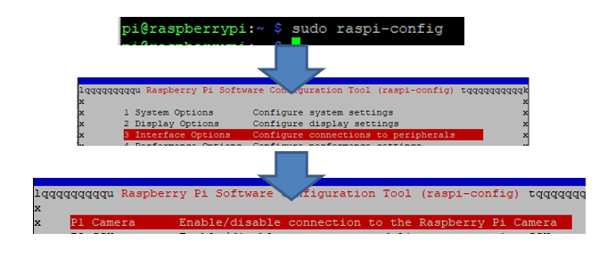

machine learning
================

Morning session

Goal
----

You should have a working cortex using the Google Coral USB Accelerator
using a pre-compiled model for pose estimation.

--------------------------------------------------------------------------------------

-   The Google Coral USB Accelerator

-   Your NB3 robot

-   SSH access via WiFi

-   A pre-compiled pose estimation model from
    [www.coral.ai](http://www.coral.ai)

Task 0: Watch introduction to Deep Learning
-------------------------------------------

In addition to our introduction video, please also watch these two
YouTube videos to better understand the live lecture in the afternoon:

-   3Blue1Brown: Deep Learning
    <https://www.youtube.com/watch?v=aircAruvnKk>\
    <https://www.youtube.com/watch?v=IHZwWFHWa-w>

Task 1: Install the Google Coral USB Accelerator
------------------------------------------------

First, install the appropriate drivers to interact with the Google Coral
USB Accelerator:

    echo "deb https://packages.cloud.google.com/apt coral-edgetpu-stable main" | sudo tee /etc/apt/sources.list.d/coral-edgetpu.list

    curl https://packages.cloud.google.com/apt/doc/apt-key.gpg | sudo apt-key add -

    sudo apt-get update

    sudo apt-get install libedgetpu1-std

You can also find the instructions here:

<https://coral.ai/docs/accelerator/get-started>

Also install the pycoral library:

    sudo apt-get install python3-pycoral

Next, plugin the Google Coral USB Accelerator into a USB 3 port (the connectors are kind of blue-ish compared to the USB 2 ports).

Task 2: Get a pre-compiled model for pose estimation
----------------------------------------------------

Download e.g. the MoveNet model from [www.coral.ai](http://www.coral.ai) and upload it to the Raspberry Pi. It should be located in the same folder as the script for inference. 

Task 3: Run our sample script for inference with a test image
-------------------------------------------------------------

We have a test script coralPose.py that uses a file called `test.jpg` and estimates the pose in this file. Double check if everything runs without any errors. If there are any errors, fix them!

Task 4: Incorporate the code into your streaming app
----------------------------------------------------

Now you should be able to integrate the pose estimation into your streaming app. Tipp: You can create the interpreter at the very beginning of the program, and only once. Just set at each image processing step the input and invoke the interpreter, and draw the points. Look at the `coralPose.py` file for the exact commands.

Result
------

At the end, you should have a live streaming feed similar to this:

